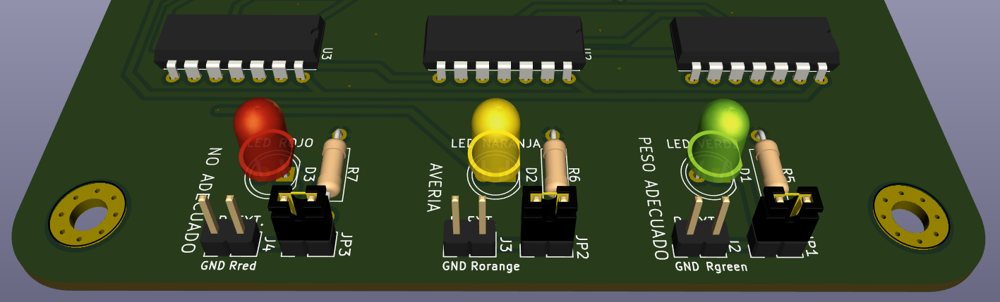

# PISU KONTROLA / CONTROL DE PESO

 

Este es el primer circuito que monta el alumnado de [Don Bosco](https://www.donbosco.eus/elektronika-mantentzen-lana/) en el ciclo de grado superior de Mantenimiento Electrónico. En vez de montar sobre una PCB, el alumnado lo monta sobre una protoboard.

Esto es parte del primer reto, en el que el alumnado sin ningún conocimiento previo ha de diseñar un sistema digital de control de peso con **4 sensores**. Cuanto más peso haya, se irán pulsando más botones hasta alcanzar la cantidad de peso optima, en el que se encenderá un **led verde.** En el caso que el peso no sea adecuado (por exceso o por defecto) se encenderá un **led rojo**. En el caso que la señal de entrada de los botones no sea lógica, se considerará que hay una avería que se indicará mediante un **led naraja**.

En este reto se busca que alumnado adquiera competencias y conocimientos en:

- Señales digitales 1/0 de entrada y de salida.

- Puertas lógicas (not, and, or...).

- Ecuaciones lógicas.

- Método de simplificación de ecuaciones con Karnaugh.

- Montaje y simulación de circuitos con puertas lógicas.

- Mantenimiento de circuitos con puertas lógicas.

El diseño ha sido realizado en [KiCad](https://www.kicad.org/), un software **open source**. Esto permite que cualquiera pueda replicar el proyecto o modificarlo según sus necesidades, facilitando su adaptación a otros usos educativos o personales.

## Puesta en marcha

Para hacer una demostración y la puesta en marcha hay que seguir los siguientes pasos:

1. Dejar la placa sobre la mesa, sin que ningún objeto metálico tenga contacto por la parte de abajo.

2. Mediante un cable usb conectar la placa a una fuente de alimentación usb o un portátil.

En este momento la placa ya es funcional por lo que se puede hacer la siguiente demostración de funcionamiento:

1. Pulsar el botón A y luego A y B a la vez para demostrar que con poco peso se enciende el diodo led de peso no adecuado.

2. Pulsar los botones A, B y C a la vez para demostrar que con peso adecuado se enciende el diodo led de peso adecuado.

3. Pulsar los cuatro botones a la vez para demostrar que con peso excesivo se enciende el diodo led de peso no adecuado.

4. Para demostrar la avería hay que pulsar alguna de las combinaciones imposibles como pulsar sólo B, sólo C, sólo D, sólo B y C a la vez, sólo B y D a la vez, sólo C y D a la vez o sólo B y C y D a la vez. En estos casos se encenderá avería y puede que algunos de los otros dos diodos leds. Como se enciende avería sólo se hace caso a la avería por lo que los otros led diodos no avisarían de nada.

Se puede mostrar la parte de electrónica analógica del reto. Para ello habría que tener una placa con resistencias en serie y paralelo que den 220 ohms de resistencia equivalente. Para conectarla hay que seguir estos pasos:

1. Quitar el jumper (JP1, JP2 o JP3) de la la resistencia interna de la placa que se quiere anular para conectar una equivalente por fuera.

2. Conectar al conector (J2, J3 o J4) la placa de resistencias equivalentes.

3. Probar los puntos 1, 2, 3, 4 de la demostración de funcionamiento.

4. 

## Puntos a mejorar

La placa de alimentación usb hay que ponerla por la parte de abajo para que vcc y gnd estén adecuadamente posicionada. Si se quiere que el USB esté por encima de la PCB habría que modificar el layout dándole la vuelta a la placa de alimentación USB y cambiando el routeo de los dos pads.

Además como mejora se puede diseñar una PCB de una fuente de alimentación de 5v. En la salida se pondría una placa de alimentación USB y mediante un cable, se podría conectar la placa de alimentación, al circuito del control de peso.
